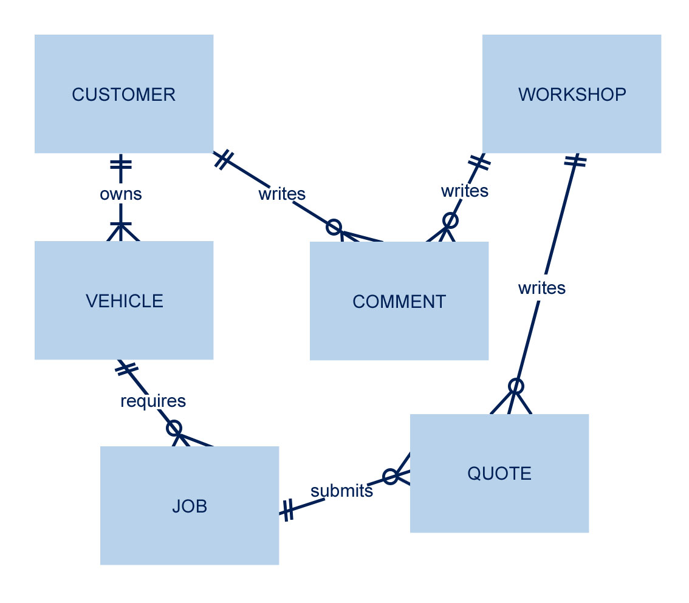

# Design Document

## RESTO-QUOTE

By Helena Boylen

Video overview: [Resto-Quote - a brief Introduction](https://youtu.be/0cDqegzj3XI)

## Scope

> The purpose of <strong>RESTO-QUOTE</strong> is to enable people who require restoration work done on unusual vehicles to find workshops that can help them from across the country.
>
> Many owners of vintage or unusual vehicles find it difficult to secure quotes for work to be done on their vehicles from workshops without personal recomendations. It may be that workshops are located far away from the customer, or that the workshop doesn't have a particulary impressive website. RESTO-QUOTE aims to be a place where customers and workshops can get into contact and customers can ask for quotes for work on their vehicles.

The database is made up of six tables:

* `Customers`: which includes the name and contact information of the customer.
* `Vehicles`: which includes the make and model of the vehicle
* `Jobs`: which details the specific tasks required on that vehicle.
* `Workshops`: which includes the name, location and contact details of the workshop
* `Comments`: which allows potential customers and workshops to make comments about a job.
* `Quotes`: which presents the quote from the workshop to the customer.

## Functional Requirements

* CRUD: Customers should be able to add, edit and delete information about their vehicles and jobs.
* CRUD: Workshops should be able to add, edit and delete quotes.
* CRUD: Customers and workshops should both be able to add, edit and delete their comments.
* Workshops should be able to view lists of quotations they've given customers to enable them to easily chase up potential jobs.
* Customers should be able to view lists of quotations given for the work required on their vehicles.
* <strong>Beyond the scope of the database</strong>: This functionality does not include any payment system or montitoring of work being done. This database purely deals with the point up to and including a workshop giving a formal quotation.

## Representation

### Entities

The schema of the SQLite tables within the database are as follows:

### Customers
* `id`: A unique identifier for the customer in the type INTEGER. (Primary Key) NOT NULL.
* `first_name`: The first name of the customer in the type TEXT, NOT NULL.
* `last_name`: The last name of the customer in the type TEXT, NOT NULL.
* `email`: The customer's email address in the type TEXT, NOT NULL  and UNIQUE.
* `username`: a single field to identify in readible terms the user's identity. A UNIQUE` constraint is added to prevent confusion with similar names.
* `password`: to ensure that only the customer can place jobs and receive quotes from workshops.

These columns are all NOT NULL to ensure that all the basic contact information is gathered. The id field is the PRIMARY KEY as it is a unique identifier and as it is a number, INTEGER is used as the type. first_name, last_name and email all use TEXT as their type as the information gathered should be simple text. The email address is also UNIQUE as it would be unlikely for multiple customers to have the same email address.

### Vehicles
* `id`: A unique identifier for the vehicle in the type INTEGER. (Primary Key) NOT NULL
* `registration`: An identifier of the vehicle in the type TEXT. NOT NULL.
* `make`: The manufacturer name e.g. Ford, Triumph, Land Rover in the type TEXT. NOT NULL.
* `model`: The vehicle's model e.g. Defender 110, Spitfire, Elan in the type TEXT NOT NULL.
* `year`: The year of manufacture for the vehicle in the type DATE.
* `customer_id`: The id of the customer in the type INTEGER NOT NULL.

Whereas all columns in Customers were required, there is a field in the vehicle table that are not required as it is feasible that the customer does not know the original year of manufacture for their vehicle (or there may be some confusion). The year of manufacture, if known, is stored as a DATE type. The Customer ID field is used as a FOREIGN KEY and references the id field in the Customers table to help ensure the correct vehicle and customer pairing.

### Jobs
* `id`: A unique identifier for the job in the type INTEGER (PRIMARY KEY) NOT NULL.
* `vehicle_id`: A unique identifier for the vehicle in the type INTEGER NOT NULL.
* `customer_id`: A unique identifier for the customer in the type INTEGER NOT NULL.
* `name`: A descriptor for the particular job required on the vehicle e.g. Respray or New distributor in the type TEXT NOT NULL.
* `description`: A longer chunk of text to outline more information about the required task in the type TEXT NOT NULL.

The job table has two FOREIGN KEYS (vehicle_id and customer_id) to ensure that the specific job/task is linked to the correct vehicle and customer. It also includes a title as a "headline" for the job and a larger chunk of text outlining the customer requirements. All fields are NOT NULL as all the information is required to enable the workshop to construct a quote.

### Workshops
* `id`: A unique identifier for the workshop in the type INTEGER (PRIMARY KEY) NOT NULL.
* `name`: The name of the workshop business in the type TEXT NOT NULL.
* `location`: The location of the workshop in the type TEXT NOT NULL
* `email`: The email address of the business in the type TEXT, NOT NULL.
* `website`: The URL of the business' website if they have one in the type TEXT.

This table stores the name and contact information for the workshop with the ID as the unique identifier and PRIMARY KEY. The location is also important as a customer might not want to work with a workshop too far away. The website URL is in the type TEXT.

### Comments
* `id`: A unique identifier for the comment in the type INTEGER (PRIMARY KEY) NOT NULL.
* `customer_id`: A unique identifier for the customer in the type INTEGER, NOT NULL.
* `workshop_id`: A unique identifier for the workshop in the type INTEGER, NOT NULL.
* `job_id`: A unique identifier for the specific job in the type INTEGER, NOT NULL.
* `comment`: The text that makes up the comment itself in the type TEXT, NOT NULL.
* `date`: The time and date that the comment is made in the type CURRENT_TIMESTAMP.

This table stores comments that go back and forth between the Customer and Workshop in discussion relating to specific jobs required for vehicles. The id field is the PRIMARY KEY for the table and the table uses three FOREIGN KEYS - customer_id, workshop_id and job_id to link the custoemer, workshop and job to the comment being made. As a vehicle might have several different jobs on-going, splitting the comments by job should ensure comments don't get lost.

### Quotes
* `id`: A unique identifier for the quotation in the type INTEGER (PRIMARY KEY) NOT NULL.
* `vehicle_id`: A unique identifier for the vehicle in the type INTEGER, NOT NULL.
* `customer_id`: A unique identifier for the customer in the type INTEGER NOT NULL.
* `workshop_id`:  A unique identifier for the workshop in the type INTEGER NOT NULL.
* `job_id`:  A unique identifier for the job in the type INTEGER NOT NULL.
* `quote`: The amount that a particular job should cost in type TEXT NOT NULL.
* `duration`: How long the job should take in the type TEXT.

This table stores the quotations from the workshops for the individual jobs on customers' vehicles. It has a unique identifier in the form of an id field plus it uses four FOREIGN KEYS (vehicle_id, customer_id, workshop_id, job_id) referencing other tables to ensure that the quotation is attached to the correct job, vehicle and customer and comes from the correct workshop. Theoretically the quote field could be NUMERIC as it is likely to be a number, BUT given the possible imprecise nature of inputs (including currency signs, dashes, "approx" etc) it is probably safer to use text.

## Relationships

The following diagram describes the relationships between tables.

* Each customer must have at least one vehicle to be a customer, but can also have many.
* Each customer can have zero or many comments whilst each comment can be associated with a single customer and a single workshop.
* Vehicles must have a single customer and can have zero to many jobs associated with it.
* Each job must be associated with a single vehicle and can have zero or many quotes associated with it - zero if no quotes have been submitted, many if many quotes have been submitted.
* Quotes must be associated with a single job. Quotes can originate from at least one workshop.
* Comments must be associated with a single customer and a single workshop.
* Workshops can have zero to many comments associated with them. They can also have zero to many quotes associated with them - zero quotes if they have yet to submit one.

## Optimizations

### Indexes to speed up searches on popular tables
* Workshop Index: attached to workshop name, location and website fields to speed up lists of workshops by location
* Vehicle Make Index: attached to vehicles make and model as these fields are likely to be searched a lot by workshops
* Jobs: attached to jobs name and date to enable workshops to search this table quicker.

### Views to present information from multiple tables quickly
* Workshop Location: Customers may well want to check a list of workshops by their location.
* New Jobs: Workshops can search lists of new jobs available for quotation by make, model, name of job, description and date requested.

## Limitations

This database really represents a single moment in the customer v workshop relationship - i.e. the request for and supply of a quotation for a specific job. Although there can be multiple customers, workshops, vehicles and jobs - the database would only handle the quotation element of the relationship. It does not deal with acceptance of a quotation, monitoring of a project or any form of payment.

As currently constructed, the database does not allow for photographs - which would be an obvious addition. It would be likely that photos would be uploaded, resized etc using another method such as PHP, which would store the photo on a server and supply a URL to the vehicle table.
